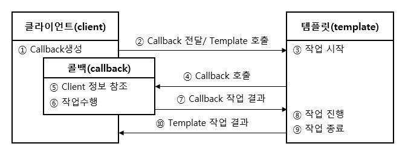

-  템플릿/콜백 패턴 (Template/Callback Pattern)

> (p240 ~ p259)

 

 

### 템플릿 / 콜백 패턴

---
템플릿 콜백 패턴이란 스프링에서 사용하는 패턴으로 템플릿 메소드 패턴과 전략 패턴에 DI를 적용하여 만든 패턴이다. 같은 작업을 하는 부분은 템플릿으로 만들고(템플릿 패턴) 달라지는 부분을 콜백 형태로 전달하여(전략 패턴) 실행하는 패턴이다. 코드가 실행되는 템플릿에 콜백을 전달할 때 DI를 활용하여 콜백 메소드(오브젝트)를 전달하게 된다.

전략 패턴과 다른 점이라고 하면 템플릿 콜백 패턴은 전달하는 전략이 단일 메소드 단위라는 점이다. 클라이언트 쪽에서 콜백 메소드를 전달하면 템플릿 메소드는 작업 흐름에 따라 콜백 메소드를 호출한다. 콜백 메소드는 전략에 따른 작업을 진행한 후 결과를 템플릿에 리턴하고 템플릿은 콜백 메소드에게 전달받은 전략에 따른 작업을 진행한다. 템플릿 메소드 작업 후 결과를 클라이언트에 전달한다.

 

**[템플릿 콜백 패턴 흐름도]**

{.aligncenter} 

1. 먼저 클라이언트는 템플릿에서 자신의 전략에 맞는 콜백을 생성한다.
2. 템플릿을 호출하면서 콜백을 전달한다. (DI 적용)
3. 호출된 템플릿은 작업을 시작한다.
4. 템플릿은 전달된 콜백을 호출한다. (전략 패턴)
5. 콜백은 Client의 정보를 참조하며 작업을 수행한다.
6. 콜백의 결과를 템플릿에 리턴
7. 템플릿은 콜백의 결과에 따른 작업을 진행한 후 결과를 클라이언트로 전달

 

스프링에서 대표적으로 JdbcTemplate 클래스가 템플릿 / 콜백 패턴으로 이루어져있다. DataSource를 이용하여 템플릿을 생성하고 각 query(콜백 메소드)에 따라 작업을 수행하여 결과를 리턴한다. 이런 구조로 DAO와 JdbcTemplate간의 낮은 결합도를 가질 수 있도록 했다. jdbcTemplate에서 지원하는 update, query, queryForObject 등의 메소드가 이에 해당한다.